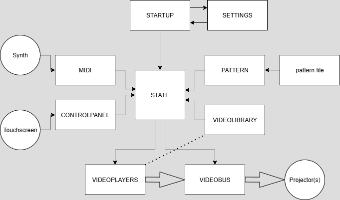

# PORTALS: **Passage Oracle for Realtime Transformation And Luminous States.**

Specification for a real-time performance sequencer for transforming and compositing multichannel video.

<https://youtu.be/3JDeF_KNhiE>

## 1. High-Level Concept

**Portals** is a performance instrument for creating complex, evolving video compositions in real time. It uses musical structures, like song sections and rhythmic steps, to sequence video transformations and effects.

Think of it like a musical sequencer, but instead of triggering notes, it triggers visual changes. You can structure a full visual performance that syncs perfectly to a song or a live musical input, with long, evolving sections (**Section Patterns**) punctuated by rapid, rhythmic changes (**Step Patterns**).

At its core, you load a "Track Preset" which contains all the visual ingredients and a "Pattern Table" which acts as the musical score for your video. Portals then listens to a master clock and incoming MIDI notes (from a drum machine, for example) to "play" that score, transforming your video channels live.

## 2. Core Concepts & Terminology

Here are the fundamental building blocks of the Portals system.

### The Big Picture

- **Session File**: This is the top-level Touchdesigner container for your entire performance setup. Loading a **Track Preset** is the first step. It bundles together everything needed for a specific track or performance:

  - **Pattern Table**: The "sheet music" for your visuals (more below). Includes
    - Session level settings
    - Section Events that define Window, Frame, and Layer parameters (e.g. Media Folder paths)
    - Step Events that define individual transforma

  - **Transformation Dictionary**: A library of all possible video effects and transformations you can call upon (e.g., "Invert", "Edge Detect", "Kaleidoscope").

  - **MIDI Map**: Defines how Portals understands the incoming MIDI signals.

  - **Parameter Dictionary**: Links physical knobs/sliders on your MIDI controller to specific effect parameters for real-time manipulation.

  - **Track BPM**: Sets the master tempo for the project.

### The Sequencing Engine

The sequencing logic is split into two layers that work together: **Sections** for the overall structure and **Steps** for the rhythmic details.

- **Section Pattern**: A long-duration transformation that defines a major section of your performance, like a verse, chorus, or bridge.

  - **Trigger**: Sections are primarily triggered automatically by a master **Section Counter** that advances based on the **Track BPM** (e.g., "start this pattern after 16 measures"). Additionally, a global manual controller trigger allows you to advance to the next **Section Pattern** at any time, overriding the counter.

  - **Function**: When a **Section Pattern** becomes active, it loads a corresponding **Step Pattern Chain** and can apply its own subtle, long-form visual transformation to a video channel.

- **Step Pattern**: A short-duration, repeating transformation that creates rhythmic visual effects, much like a step in a sequencer.

  - **Trigger**: Steps are triggered by counting incoming MIDI note events on a specific MIDI channel (e.g., "trigger on every 2nd kick drum hit").

  - **Function**: Applies a single, distinct visual effect from the **Transformation Dictionary** to a video channel, using a pre-defined set of parameter values from the **Pattern Table**.

- **Step Pattern Chain**: A sequence of **Step Patterns** that play in a specific order. Each **Section Pattern** has its own unique **Step Pattern Chain**. This is the core of the system: as the song moves from one section to the next, the entire rhythmic sequence of visuals (the Step Pattern Chain) also changes.

#### Counters & Triggers

- **Section Counter**: A master project clock that counts beats or measures based on the **Track BPM**. It is used to trigger **Section Patterns**. This counter does not reset during the performance.

- **MIDI Event Counter**: Each MIDI channel has its own dedicated counter. This counter doesn't track time; it tracks the _number of notes_ received on that channel. This is what triggers the **Step Patterns**. For example, if a Step Pattern's trigger value is '4', it will activate on the 4th, 8th, 12th, etc., note received on its channel. This counter resets every time its target count is reached and a pattern is triggered.

- **Repetition Counter**: Each active **Step Pattern** has a counter that tracks how many times it has been triggered. Once it meets its target number of repeats, Portals moves to the next **Step Pattern** in the **Step Pattern Chain**.

## 3. The Workflow: How It All Works

Here’s a step-by-step description of how you would use Portals for a performance:

1. **Load a Preset**: You begin by loading a **Track Preset**. This instantly sets up your environment: the media is located, the MIDI mappings are active, and the **Pattern Table** is loaded and ready. Starting the preset also starts the master **Section Counter**.

2. **Sections Begin**: As the **Section Counter** advances, it will eventually hit the trigger value for the first **Section Pattern** in your **Pattern Table**.

3. **A Step Chain is Activated**: When this **Section Pattern** is triggered, Portals looks up its associated **Step Pattern Chain** and makes the _first_ **Step Pattern** in that chain active for that MIDI channel.

4. **MIDI Triggers the Steps**: Now, you start sending MIDI notes (e.g., from a drum machine). Portals listens on the specified MIDI channel. When the **MIDI Event Counter** for that channel reaches the trigger value of the active **Step Pattern** (e.g., it receives its 2nd note), two things happen:

    - The visual transformation defined by the **Step Pattern** is applied to the target video channel, using the specific **Transformation Values** listed in the table for that pattern.

    - The pattern's **Repetition Counter** increases by one.

5. **Repeating and Advancing**: This **Step Pattern** will continue to trigger every 2nd MIDI note until its **Repetition Counter** is full (e.g., it has repeated 8 times). Once complete, Portals automatically makes the _next_ **Step Pattern** in the chain active, and the process continues with the new effect and its own trigger/repeat rules.
   **Note:** Using repetitions in the step pattern allows for a kind of visual polyrhythm, and allows for sections of arbitrary length, so you can improvise while playing.

6. **Sections Change**: This continues until the master **Section Counter** hits the trigger for the _next_ **Section Pattern**, or the global manual trigger is activated. When the new Section begins, the current **Step Pattern Chain** is discarded, and the new one associated with the new Section is loaded. The step-level sequence now follows a completely new set of rules and effects, creating a dynamic shift in the visuals that corresponds to the change in the music.
   **Note:** Using Section Patterns as a higher-level structural element ensures that if a MIDI note is missed by the sequencer, that when the next Section Pattern is triggered the entire visual sequence gets back into sync.

7. **Realtime Manipulation**: Throughout this entire process, you can use knobs and faders on your MIDI controller to manipulate the parameters of the active visual effects in real time, as defined by your **Parameter Dictionary**. This will override the initial **Transformation Values** for as long as you are interacting with the controller.

## 4. Data Structure Reference

### Pattern Table

This is a plain text file (`.csv` or `.tsv`) that acts as the master script for the entire visual performance. Each row defines a potential event.

| Midi Channel                                            | Video Channel                                         | Step Trigger                                                              | Section Trigger                                                     | Repeats                                                             | Transform Key                                                         | Transformation Values                                                                                                           |
| ------------------------------------------------------- | ----------------------------------------------------- | ------------------------------------------------------------------------- | ------------------------------------------------------------------- | ------------------------------------------------------------------- | --------------------------------------------------------------------- | ------------------------------------------------------------------------------------------------------------------------------- |

#### Description

| The MIDI input channel (e.g., 1 for kick, 2 for snare). | The video output channel the effect will apply to. \* | The number of MIDI events to count before triggering (for Step Patterns). | The master clock measure/beat to trigger on (for Section Patterns). | The number of times a Step Pattern should execute before moving on. | The name of the effect to use from the **Transformation Dictionary**. | A list of key-value pairs that set the initial parameters for the transformation. (e.g., `Rotation:90, XPos:Scroll, Alpha:0.5`) |
/* _Channels are referenced by Monitor, Layer, and Type (V for Video, M for Mask). For example, `A1V` targets Monitor A, Layer 1, Video. `B2M` targets Monitor B, Layer 2, Mask. `R` can be used for a random layer, e.g., `ARV`._

- Midi Channel: Note
- Pattern Channel: Section | Step | Loop
- Video Channel: Window | Frame | Layer | Modulation
-

### 4.1. Sample Pattern Table

midi_channel, window, frame, layer, section, trigger_step, loop_count, mod_function, mod_values  

kick,0,1,2,intro,8,5,print,"""testing mod kick function"""

snare,0,2,2,intro,2,5,print,"""testing mod snare function"""

clap,0,3,2,intro,7,5,print,"""testing mod clap function"""

kick,0,1,2,intro,1,5,print,"""testing mod kick function"""

snare,0,2,2,intro,1,5,print,"""testing mod snare function"""

clap,0,3,2,intro,1,5,print,"""testing mod clap function"""

#### SECTION NOT COMPLETE

This example shows a simple arrangement for an intro, two repeating sections of a song, and an outro using three MIDI channels.

The Track is in 4/4 time at 90 BPM.
The Intro is 4 bars long ( 4 bars × 4 beats per bar = **16 beats**
Section One is 8 bars (8 bars × 4 beats per bar = **32 beats**
Section Two is 16 bars (16 bars × 4 beats per bar = **64 beats**
Outro is 8 bars. (8 bars × 4 beats per bar = **32 beats**

In the Midi Map, you'll have something like

| Name  | Note    | Channel |
| ----- | ------- | ------- |
| Kick  | ch10n37 | 1       |
| Snare | ch10n39 | 2       |
| HiHat | ch10n43 | 3       |

In the **Pattern Table**

| Midi Channel | Video Channel | Step Trigger | Section Trigger | Repeats | Transform Key | Transformation Values                      |
| ------------ | ------------- | ------------ | --------------- | ------- | ------------- | ------------------------------------------ |
|              |               |              |                 |         |               |                                            |
| 1            | R1V           | 1            | 1               | 1       | Pulse         | `StartScale:1, EndScale:1.1, Duration:0.2` |
| 1            | R1V           | 1            | 1               | 1       | Pulse         | `StartScale:1, EndScale:1.1, Duration:0.2` |
| 2 (Snare)    | B1V           | 1            | 1               | 16      | Shuffle       | `Direction:Horizontal, Amount:0.1`         |
| 3 (HiHat)    | A1V           | 2            | 1               | 32      | Invert        |                                            |
| 1 (Kick)     | A1V           | 2            | 9               | 16      | Scale         | `StartScale:1, EndScale:0.8, Duration:0.1` |
| 2 (Snare)    | B1V           | 1            | 9               | 16      | Reverse       |                                            |
| 3 (HiHat)    | ARV           | 1            | 9               | 64      | Pulse         | `StartAlpha:1, EndAlpha:0, Duration:0.1`   |

in the intro the kick plays on the 3.

**Explanation:**

- **In the Verse (starting at measure 1):**
  - Every **Kick** hit triggers a gentle `Pulse` on video channel A1V.
  - Every **Snare** hit triggers a horizontal `Shuffle` on video channel B1V.
  - Every other **HiHat** hit triggers a color `Invert` on A1V, creating a fast strobing effect.

- **When the Chorus starts (at measure 9):**
  - The active patterns change completely.
  - The **Kick** now triggers a quick `Scale` down effect every other hit.
  - The **Snare** now triggers a playback `Reverse` on channel B1V.
  - The **HiHat** now triggers a rapid alpha `Pulse` (a fade out) on a **random** video layer (`ARV`), creating a sparkling, unpredictable texture.

## 5. Glossary of Terms

- **Track Preset**: The master file that contains all settings for a performance: media paths, MIDI maps, effect libraries, and the Pattern Table.

- **Pattern Table**: The "sheet music" for the visual performance, laid out in a table, telling the system what to do and when.

- **Transformation Dictionary**: The library of all available visual effects and transformations that can be applied to video channels.

- **Section Pattern**: A long-duration sequence that corresponds to a major song section (like a verse or chorus). It determines which **Step Pattern Chain** is currently active.

- **Step Pattern**: A short-duration, rhythmic visual effect triggered by a specific count of incoming MIDI notes.

- **Step Pattern Chain**: A specific sequence of **Step Patterns** that are activated one after another. A new chain is loaded with each **Section Pattern**.

- **MIDI Map**: A configuration that assigns readable names to incoming MIDI channels and notes.

- **Parameter Dictionary**: A configuration that links physical MIDI controller knobs and sliders to specific parameters of the visual effects for real-time manipulation.

- **Section Counter**: The master clock that triggers **Section Patterns** based on musical time (beats and measures).

- **MIDI Event Counter**: A per-channel counter that triggers **Step Patterns** based on counting a number of incoming notes, not on musical time.

- **Repetition Counter**: A counter that tracks how many times a single **Step Pattern** has repeated before advancing to the next pattern in the chain.

c1 - ch10n37 - Kick
c#1 -  ch10n38 - Rimsht/Clave
d1 - ch10n39 - snare
d#1 - ch10n40 - Clap
e1 - ch10n41 - Snare
f1 - ch10n42 - lotom
f#1 - ch10n43 - ClsdHiHat
g1 - ch10n44 - LoTom/LoCong
g#1 - ch10n45 - ClsdHiHat
A1 - ch10n46 - MidTom/MidCong
A#1 - ch10n47 - OpnHiHat
B1 - ch10n48 - MidTom/MidCong
C2 - ch10n49 - HiTom/HiCong
C#2 - ch10n50 - Cymbal
D2 - ch10n51 - HiTom/HiCong
D#2 - ch10n52 - Cowbell

to ref channel
op('str{chan}')

43 - F#1 - Cls'd Hihat
46 - A#1 - OpenHihat
49 - C#2 - CYmbal
56 - G#2 - CowBell
39 - D#1 - handClaP
37 - C#1 - RimShot
50 - D2 - HiTom
47 - B1 - MidTom
43 - G1 - LowTom
38 - D1 - SnareDrum
36 - C1 - BassDrum
42 - F#1 - Cls'dHihat
46 - A#1 - OpenHihat
49 - C#2 - CYmbal
56 - G#2 - CowBell
70 - A#3 - MAracas
75 - D#4 - CLaves
62 - D3 - HiConga
63 - D#3 - MidConga
64 - E3 - LowConga
38 - D1 - SnareDrum
36 - C1 - BassDrum

## PORTALS Dev Notes

19-07-2025
TD2025.30060

framework inspo: Noah Norman <https://youtu.be/nQT7EhYCVg0?si=dsdZKY6UBHnZ7C-W>
git into it: Matthew Ragan: <https://matthewragan.com/2017/12/03/touchdesigner-working-styles-git/>
details on extensions: <https://derivative.ca/UserGuide/Extensions>

## 7-21 Pythonic Extensions

### Parameters

Controls exposed on parameter page of components, script ops and c++ ops.
(easiest way to create: using the RMB -> Customize... dialog on any component or Script Operator.)
    Naming: Uppercase first letter ONLY, NO underscores
    Documentation: <https://derivative.ca/UserGuide/Custom_Parameters>
    Declaration:
        baseOp = op.VIDEOLIBRARY
        newPage = baseOp.appendCustomPage('Controls')
        newTuplet = newPage.appendPulse('Startsearch', label='Click to Start Search')

#### Internal Parameters

Only available inside the component. Details: <https://docs.derivative.ca/Internal_Parameters>

### Attributes

Standard Python variables directly associated with an object's instance

### Properties

like attributes but they have accessor functions (getter, setter, deleter).
    Naming: Capitalized to be promoted. lowercase for internal only.
    Documentation: <https://docs.derivative.ca/Extensions#Python_Properties>
    Declaration:
        TDF.createProperty(self, 'MyProperty', value=0, dependable=True,
         readOnly=True)

## 7-22 add external python dependencies

<https://derivative.ca/community-post/introducing-touchdesigner-python-environment-manager-tdpyenvmanager/72024>

see also: <https://docs.derivative.ca/Experimental:Palette:tdPyEnvManager>

eg. add VideoLibraryExt to the owner component

via Palette> tdPyEnvManager:
in OP.tdPyEnvManager pulse Open CLI
pip install moviepy
etc.

